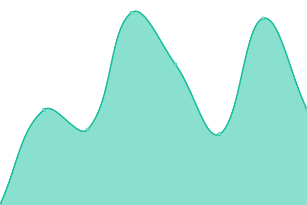

# [📈 Live Status](https://XanHelpers.github.io/StatusPage): <!--live status--> **🟧 Partial outage**

This repository contains the open-source uptime monitor and status page for [Xan](https://XanHelpers.github.io/StatusPage), powered by [Upptime](https://github.com/upptime/upptime).

With [Upptime](https://upptime.js.org), you can get your own unlimited and free uptime monitor and status page, powered entirely by a GitHub repository. We use [Issues](https://github.com/XanHelpers/StatusPage/issues) as incident reports, [Actions](https://github.com/XanHelpers/StatusPage/actions) as uptime monitors, and [Pages](https://XanHelpers.github.io/StatusPage) for the status page.

<!--start: status pages-->
<!-- This summary is generated by Upptime (https://github.com/upptime/upptime) -->
<!-- Do not edit this manually, your changes will be overwritten -->
<!-- prettier-ignore -->
| URL | Status | History | Response Time | Uptime |
| --- | ------ | ------- | ------------- | ------ |
|  [Xan WebSite](https://xandevelopers.tk) | 🟥 Down | [xan-web-site.yml](https://github.com/XanezDevelopers/StatusPage/commits/HEAD/history/xan-web-site.yml) | 

 0ms
     
 | 

<a href="https://XanHelpers.github.io/StatusPage/history/xan-web-site">0.00%</a>
    

|  [Xan Docs](https://docs.xandevelopers.tk) | 🟥 Down | [xan-docs.yml](https://github.com/XanezDevelopers/StatusPage/commits/HEAD/history/xan-docs.yml) | 

 2083ms
     
 | 

<a href="https://XanHelpers.github.io/StatusPage/history/xan-docs">69.15%</a>
    

|  [Hacker News](https://news.ycombinator.com) | 🟩 Up | [hacker-news.yml](https://github.com/XanezDevelopers/StatusPage/commits/HEAD/history/hacker-news.yml) | 

 240ms
     
 | 

<a href="https://XanHelpers.github.io/StatusPage/history/hacker-news">100.00%</a>
    

|  [Test Broken Site](https://thissitedoesnotexist.koj.co) | 🟥 Down | [test-broken-site.yml](https://github.com/XanezDevelopers/StatusPage/commits/HEAD/history/test-broken-site.yml) | 

 0ms
     
 | 

<a href="https://XanHelpers.github.io/StatusPage/history/test-broken-site">100.00%</a>
    

<!--end: status pages-->

[**Visit our status website →**](https://XanHelpers.github.io/StatusPage)

## 📄 License

- Powered by: [Upptime](https://github.com/upptime/upptime)
- Code: [MIT](./LICENSE) © [Xan](https://XanHelpers.github.io/StatusPage)
- Data in the `./history` directory: [Open Database License](https://opendatacommons.org/licenses/odbl/1-0/)
